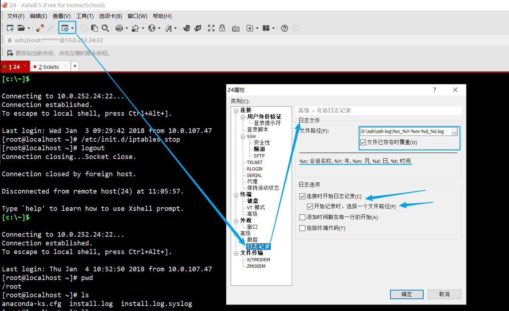

### 计算机基础 

计算机的四个时代:电子管（46~58）、晶体管（58~64）、中小规模集成电路（64~70）、大规模和超大规模集成电路（71~90年代）

### 硬件基础

- PC服务器
  - 1U = 4.445cm
- 互联网企业一般都用戴尔的PC服务器，这是在五年前，现在不清楚是不是这样
- 一台电脑是有许多零部件组成的，其中**主板**是核心,CPU、内存、硬盘、显卡、声卡等零部件通过物理插槽或数据线等介质与主板建立连接协同工作。
- 主板就相当于人体的骨架
- 电源：相当于人的心脏
- **CPU**：中央处理器，负责运算和控制，是电脑的最关键部位，是计算机的头脑
- CPU风扇：给CPU降温，服务器风扇不好可能会导致死机或者重启
- BOIS芯片：负责主板通电后各部件自检，开机的时候先由BOIS读取硬件信息，检查完毕后BOIS会发送指令，然后启动操作系统，这里需要对开机流程有一定的了解
- **硬盘**：①、负责计算机断电后的数据存储；②、CPU会从硬盘中读写数据。硬盘的性能是网站优化的重要一环
- **内存**：是电脑的一个临时存储器，只负责电脑数据的中转。优点是比硬盘快十万倍，正常来说CPU和内存打交道，内存再和硬盘打交道
- 网站优化:计算机领域中,缓存无处不在,内存和CPU之间、内存和磁盘之间都存在缓存
  - 在有大量**写入**的情景下通常门户网站的做法是先将用户写入的数据放到内存,然后再通过定时任务等功能程序写入磁盘,这样做很快,但是可能丢失数据,对于这样的大公司来说宁可丢失点数据也不希望出现门户网站打不开的情况;而中小型企业因为不涉及到高并发,通常是将数据直接写入磁盘,然后在通过程序放到内存中,这样做的好处是虽然慢但是安全,不会丢失数据
- 显卡：对于服务器来讲，显卡一点都不重要，对于游戏玩家来说很重要
- 光驱：越来越多的电脑不配光驱了，服务器一般都是网络安装，不需要光驱安装软件

### 生产中的应用小结

- ①、PC服务器：互联网公司主要应用的服务器品牌包括DELL、HP、IBM，国内服务器提供商有浪潮、联想、华为、航天联志等，但是最主流的还是DELL。
- ②、电源：如果一个人干活最好选用双电的电源，俩人以上可以使用单电电源，因为更便宜
- ③、CPU：负责运算和控制，是服务器性能的核心部件。一般的企业CPU颗数为2~4颗，一颗CPU双核~四核
- ④、内存：CPU和磁盘之间的缓冲，是临时存储器。一般程序运行的时候会被调度到内存中，这也就是所谓的**进程**。
  - 进程和程序的区别：
    - 程序：静态的，存在于磁盘中
    - 进程：运行着的程序，放在内存中
    - 程序重启，内存中的数据会释放掉
  - 门户案例：高并发大数据量的时候，会把数据先写到内存，然后再定时或者定量的写到磁盘，最终还是会加载到内存，特点就是快但是可能会丢失一部分在内存中还没有来得及存入磁盘的数据，因为一旦断电等情况发生，内存中的数据立刻就会消失
  - 中小企业：并发不大，会先把数据存放到磁盘，然后通过程序把数据读入到内存，再对外提供访问服务，由于90%的网站都是读取为主，所以并发写入不是问题。ps：这里的内存和硬盘可能是多台机器组成的集群
- ⑤、磁盘：磁盘接口包括SAS、SATA和SSD，性能上SSD>SAS>SATA,常规工作场景选SAS,线下备份的时候选用SATA,高并发的情况下用SSD

### Linux初探

- ①、什么是操作系统？操作系统（Operating System，简称OS）是沟通使用者和硬件之间传递信息的工具或程序。操作系统的官方定义：是电子计算机系统中负责支撑应用程序运行环境以及用户操作环境的**基础系统软件**。
- ②、Unix特点：技术成熟、可靠性高、网络和数据库功能强、伸缩性突出和开放性好。曾经是服务器系统的首选，但近年来与Windows SERVER和Linux的竞争中，热度有所下滑
- ③、Linux系统概述：是一套免费使用和开放源代码并且可以自由传播的类Unix操作系统。其目的是建立不受任何商品化软件的版权制约的、全世界都能自由使用的Unix兼容产品。
- ④、GNU和GPL：GNU是"GNU is Not Unix"的递归缩写,它的目标是建立可自动发布和可移植的类Unix操作系统;GPL(General Public License)是通用公共许可,是最著名的**开源许可协议**，保证任何人有共享和修改自由软件的自由,任何人有权取得、修改和重新发布自由软件的源代码全力，但是要求把具体的改动发布出来
- ⑤、ssh、ftp和Telnet的区别：FTP和Telnet本质上都是不安全的，因为它们在网络上用明文传送数据、用户账号和用户口令；ssh是secure Shell的缩写，是目前较可靠专为远程登录会话和其他网络服务提供安全性的协议，可有效防止远程管理过程中的信息泄露问题。
- ⑥、如果出现连接超时或者拒绝连接的情况时，应从以下几种情况进行分析：
  - 一、服务器防火墙（iptables）截断了连接请求。
    - 解决办法：/etc/init.d/iptables stop
  - 二、服务器端没有开启ssh服务或者默认端口22被占
  - 三、客户端到服务器端的线路有问题
    - 检测方法:ping 服务器主机地址

### 工具的使用

这里以Xshell为例

- ①、日志记录：配置完成后即可保存所有操作记录,很实用!!!

  日志的位置如下：

  修改完成后需要退出重启才能生效，退出当前用户的快捷键是Ctrl + D

- ②、除了专门支持`FTP` 协议的软件以外，还有什么方法可以实现客户端和服务器端的上传下载？如下：

  试一下吧:

  试试上传,不截图了,上传的命令是**`rz -y然后直接回车`**,然后将你想上传的文件双击一下即可!测试已经成功!

  小结:这种方式上传下载的必须是文件!!!这样的话如果想传输多个文件可以打成包再搞

- ③、Xshell中的批量操作在界面的最下方，如图

  但是注意交互的操作不行，例如vim交互工具和上传rz没法通过批量操作完成，但是有这种需求的时候一般都会有替代的方法

- ④、以上的配置只是针对的一个连接，当需要连接到一个新的主机的时候这些又需要重新配置，怎么能省下这一步呢？在会话中，选择配置完备的那个连接复制粘贴一下：

  然后更改连接属性：

  这样就`OK`了,如果登录名和密码需要修改,点击"用户身份验证"修改即可.

### 常用命令(一)

- "#"代表当前操作角色是root用户，其他的符号如$表示的是普通管理员

- Linux的命令形式通常为：命令  可选参数   路径文件(也是可选的)

- **创建目录命令**: `make directory  =>  mkdir`   +     路径即可创建目录了

- 查看指定的目录是否存在: ls -ld 路径

- 切换目录众所周知用cd命令,全称是change directory

- **删除目录**:rm -rf  目录路径(强制(-f)递归(-r)删除某一文件夹)

- **新建文件** : `touch` 文件名  可以这样理解,touch是"摸"的意思,创建文件的时候就是摸一下文件,如果文件不存在就创建新文件,如果存在就改变文件的访问时间等时间戳信息

- 一个常识:Windows下的目录路径使用"\"间隔的,而Linux是用"/"间隔的

- 编辑文件:vi/vim  文件名,实际上如果没有对应的文件这种方法也可以新建文件,但是需要在退出的vi模式的时候保存, :wq  (write quite  :  写入退出)

- **查看文件的内容** : `cat 文件名` 

- vi编辑器有三种模式:分别是普通模式、编辑模式和命令行模式，三种模式的切换示意图如下：

- **`echo`**  :   和PHP中的echo类似,就是输出内容用的,但是在Linux中经常和 ">" 或 ">>" 连用, 前者表示**覆盖**文件中的原有内容,后者表示**追加** , 官方定义">"或">>" 就是重定向的意思

- 类似`echo` 打印输出的命令还有个printf,可以进行复杂的输出,目前知道有这么个东西就好啦

- **`cat`**深度研究 :  `cat >> 文件 << 标识(开始)`

  ​			内容1

  ​			内容2

  ​			内容3

  ​			`标识(结束)`

  可将多行内容追加到指定文件中

- 实际上**写入文件**的方法很多,**cat > 文件**  也可以实现向文件中写入内容,不过也是覆盖的,如果只想在原有内容的末尾追加,则**cat >> 文件** 即可(了解即可)

- 将文件拷贝到指定目录:`cp 文件名 目录名`   ,   cp(copy)默认情况下只能拷贝文件不能拷贝目录,如果想拷贝目录需要参数r,表示递归复制目录

- **小技巧**:很多情况下,Linux中的命令让人不知所云,因为缩写太严重,对于不是英语语系的学徒来说无形中增加了学习成本,那么如果不知道一个命令具体是什么意思的时候可以**`man + 命令`** 一下,Linux会给出详细释义以及该命令的英文全称

- 另外一个小技巧 : 通常情况,一个命令下会有很多的选项,不需要全部记忆,`--h`即可查看,好比`cp --h` 即可查看cp命令下的所有选项及其用法

- 删除一个**空**目录 :  `rmdir 目录路径` ,   这是最最合适的删除空目录的方法

- **`pwd`** :  查看当前工作空间, 实际上就是查看当前所在位置

- 实际生产环境中的删除目录或文件:先记下来吧

- **`grep`** :  被称为`Linux`命令三剑客之一,可见其在`Linux`中的核心程度,可以把其理解成一个"筛子",至于你想要筛掉的东西还是留在筛子里的东西可通过选项v来自行控制,-v后跟排除的内容,说白了这时候咱们要的是筛子里的东西,如果想要过滤出筛子外面的东西,那就不要用-v选项了,直接写过滤的关键词即可.如图:

  `PS  :  grep`是按照行进行过滤的,所以上图只要写能标志出过滤行的关键字即可

- **`head`** :  显示文件的头部,一般和`-n`选项连用,写法如下:`head -n 行数 文件`  ,  也可以直接`head -行数 文件`  表示显示文件头部的多少行,`PS`  :  `head`默认显示文件的前10行信息

- 说到`head` ,  就不得不提下`tail` ,  表示显示文件的尾部,用法和`head`一样 , 工作中通常用于查看日志

- **`mkdir`**深度研究 :  ①、这个命令可以同时创建多个目录，目录名之间用空格隔开即可

  ​			     ②、一次性递归创建目录，可用-p选项，如图：

  用tree命令查看下day03的目录结构:

  `PS`  :  tree是需要安装的:

  `yum install 软件名 -y`  也是使用`yum`安装软件的通用方法

- 修改主机名字:默认的主机名儿是`localhost` ,通过`hostname 新的主机名儿` 即可修改,这步操作也是要退出重新登陆以后才会生效的
