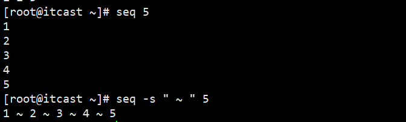
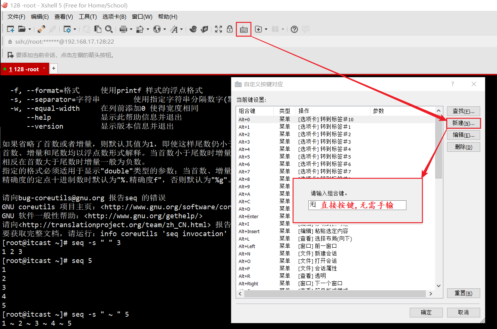

### 常用命令(二)

- `Xshell`每次连接远程主机的时候可以用:`ssh 主机名@IP地址` 来直接连接,目前来看这种做法主要是为了装逼,其实并没有使用可视化界面连接来的快

- `which + 命令`  :  汇报命令所在位置

- `alias`  :  可查看当前系统下已有的别名

- `cp、mv、rm` 等命令在使用的时候默认需要确认，防止误操作，如果我一次性复制很多文件一个个的确认是不是很繁琐，有什么解决办法以及这种机制的原理在哪里呢？`alias`一下可以发现`cp`实际上是`cp -i`的别名 ，-i的意思就是覆盖前**询问** ，这就是原因。如何能不让它询问直接复制呢，`which`一下`cp` ， 可以发现这个命令的位置在`/bin/cp` 这里,那就直接用`/bin/cp`来操作就好可以了.还有一种方法就是直接用/cp来操作.私以为命令的默认路径在bin下,所以这种写法也相当于定向到了`/bin/cp`

- 别名的意义:正如上边所说,别名除了显而易见的简化书写以外还可以阻挡门外汉对服务器的危险命令的瞎操作,当然只要稍微掌握一点Linux的基本知识就可以运用which找到命令的实际位置从而破除掉这种阻隔.实际上单单是简化书写这一点也给操作人员带来了极大的便利,比如可以给常用的比较复杂比较长的命令起别名,会极大地提高效率

- 别名的取消:`unalias + 命令`

- 之前提到过删除文件的方法:`rm -f 文件路径` （这里的`-f`实际上就是`force`的简写,意为不询问并强制删除）。好，现在有一个需求，需要删除`root`目录下的五天前的`log`日志，命令该如何写？  之前贴出过生产环境中删除文件的方法，先`find` 揪出匹配文件，然后进行删除。命令格式如下：`find 目录 -type 参数(包括d、f，d代表目录，f代表文件) -mtime（modify time 最后一次的修改时间）+天数（当然也可以用-，好比+5代表最后一次修改的时间距今超过5天的文件，-5就是不足5天的文件）| xargs rm -f  `  ,这里单独的重点说一下**`xargs`** ,该命令的主要功能是从输入中构建和执行`shell`命令 ,不理解没关系,只要记住这个命令最常见的用法就是和`find`连用就可以了.find命令的-exec选项也可以实现类似xargs的功能,但是在用exec处理匹配到的文件时,find会将匹配到的文件一股脑的传递给exec执行,这样可能会出现的问题就是find命令运行几分钟之后,就会出现溢出错误,错误信息通常是"参数列太长"或"参数列溢出",而这也正式xargs的意义所在,**这个命令每次只获取一部分从`find`命令传递过来的匹配文件而不是全部**,这样它就可以先处理最先获取的那部分文件,然后是下一批,并如此继续...

  因此上边需求的正确写法如下:

  `find /root/ -type f -name "*.log" -mtime +5 | xargs rm -f` 

  `ps` :  这些参数`man find`一下全都有,下面看一下find命令的`mtime`时间的示意图:

  

- 管道命令:操作符是"|",它仅能处理经由前面一个指令传出的正确**输出信息** , 将这个输出信息作为**标准输入**来操作,我的理解是结合`PHP` 中方法的封装,最终有一个返回值(这个返回这就可以理解成输出信息),其他方法想用这个返回值就得调用这个方法,拿到这个返回值再进行下一步处理(拿到这个返回值以后的所有操作都视这个"返回值"为自己人了,想怎么用就怎么用,也就是所谓的标准输入).受到之前学习的影响,其实管道并不是只和grep连用,cut、sort、uniq、wc等等都常和管道配合使用。

  回顾下查看`nginx`进程的命令：`ps -ef | grep nginx` 

- 有这样一个需求:打印`test.txt`中第20行到第30行的信息

  - ①、`head -30 test.txt | tail -11` 因为`20~30` 一共11行
  - ②、`tail -81 test.txt | head -11` 原理同上. 相比于方法①,方法②更低效,因为②在使用管道之前查的东西更多。本着简单易用高效的原则，不推荐使用管道出结果
  - ③、`sed -n 20,30p test.txt` 要形成一个惯性,以后只要说到取行,就用sed.所以这种方法目前来看是最优解
  - `sed` 也号称`Linux命令三剑客`之一,实际上是stream editor的简写,是一个很好的文本处理工具,目前先知道这个命令很重就可以了,后期会单独总结
  - ④、`awk '{if(NR>19&&NR<31) print $0}' test.txt` ,`awk`号称Linux命令三剑客中的老大,可见其重要程度,但是这里显然用`sed`更合适,同样的,后面会做总结.先知道awk尤其擅长列的处理就可以了

- `sed` 用法之**替换文件内容** : 格式一般是`sed -i s#修改之前的内容#修改之后的内容#g 文件路径` `sg`表示全局替换.那好了，现在有个需求，找到root目录下所有以.sh结尾的的文件,并将其中包含`./itcast.txt`的字符串全部替换成`./heima.txt` 

  思路: `先找到这些文件,再通过管道交给sed处理` 

  解答:`find ./ -name "*.sh" -type f | xargs sed -i s#./itcast.txt#./heima.txt#g`  确保是在`root`目录下.

- `seq` : 打印数字序列,默认是竖排打印,可以用参数s指定分隔符的方式横向打印,如图:

  类似于`echo {1..5}`的输出形式,现在只要知道{}可以配合`echo`打印序列就可以了,而且这种方式还可以打印字母序列.

### 快捷键

- 快捷键自定义配置这样就可以配置像复制粘贴等常用的快捷键了

- `Xshell`自带的快捷键(可能也是所有`SSH`远程终端工具都配置好的快捷键) : 

  ①、`Tab`  : 命令或路径补全

  ②、`Ctrl + C` : 终止当前任务命令或程序

  ③、`Ctrl + D` : 退出当前用户环境.相当于exit和logout

  ④、`Ctrl + A  和  Ctrl + E` : 前者相当于`Home`按键 ,后者相当于`End`按键.

  ⑤、`Ctrl + U` : 剪切光标所在位置到行首间的字符

  ⑥、`Ctrl + R` : 从历史记录中查找写过的命令

  ⑦、`history` : 这个不属于快捷键,可以通过这个命令查看自己写过的历史命令

  ⑧、`! + 历史命令的行号` : 直接执行对应的历史命令

  ⑨、`Esc + .` : 相当于复制粘贴上一个命令后面的参数

  ⑩、按住`Alt`拖动光标可跨行任意选择区域

### 系统级命令

- 常识:`32`位和`64`位系统的区别比较核心的就是大内存的支持不同和`CPU`的运算能力的不同。`32`位系统理论上最大只可支持`4G`内存，了解即可,因为`32`位的基本已经被淘汰了
- 查看系统版本 : `cat /etc/redhat-release` 
- 查看内核版本 : `uname -r`
- `uname -m` :  查看系统位数
- Linux系统的设备(包括光驱、软驱、硬盘等等)都放在/dev下面

### 优秀的工具

- 比较工具: `vimdiff 文件1 文件2`  按`:q!` 退出比较界面

### 用户相关操作命令

- `whoami` : 查看当前用户
- `useradd 用户名` : 添加用户
- `passwd + 用户名 + 回车` : 修改指定用户的密码
- `su - 用户名` : 这个 '-' 的作用就是 将用户的整个环境变量带过去,是更合适的切换方式
- 常识:从root用户切换到普通用户不需要任何密码,但是反向切换必须输入root的密码

### yum

- `yum`就是安装软件的一个工具.官方定义:`yum`是交互式的**基于**`rpm`的包管理器. Linux中的rpm软件可以理解成Windows中exe文件.原始的安装软件方式是 : `rpm -ivh 软件包` , 相比之下`yum`的优势在于可以解决包与包之间的依赖关系,实际上`yum`在安装的时候也是调用的`rpm`进行的安装
- `yum(Yellowdog Updater Modified)`源配置目录默认位置 :  `/etc/yum.repos.d/` 
- `CentOS`系统`yum` 源默认从国外网站centos.org下载物料,所以说安装的时候可能会很慢,国内有很多大网站可以提供免费的镜像,因此我们需要将默认源改到国内的这些网站之一.步骤:
  - 以网易开源镜像站为例
  - 切换到`yum`源配置目录 : `cd /etc/yum.repos.d/`
  - 目录下`CentOS-Base.repo` 就是默认的`yum`源,备份一下,以后备份文件统一用`.ori`结尾:`cp(或mv) CentOS-Base.repo CentOS-Base.repo.ori` , 因为之前在学习的时候更改了默认`yum`源为阿里镜像,这里再将这个镜像备份一下,以`.ali`结尾
  - 下载网易镜像源:wget http://mirrors.163.com/.help/CentOS6-Base-163.repo
  - 下载完成后重命名成最初的默认源的名字即可:`mv CentOS6-Base-163.repo CentOS-Base.repo` 


### 基本的调优

- 关闭`selinux(是Security-Enhanced Linux的缩写)` ，这是一个安全性方面的工具，不关闭老会提醒，为了避免这种提醒浪费时间（实际上是不想加大学习成本），建议先关闭`selinux` 

  ```
  ①、查看selinux的配置文件:cat /etc/selinux/config
  ②、找到SELINUX=enforcing , 改成SELINUX=disabled :  典型的文本内替换,用sed
  	sed -i s#SELINUX=enforcing#SELINUX=disabled#g /etc/selinux/config
  ③、替换后查看 : grep "disabled" /etc/selinux/config 
  ```

- `cat /etc/inittab` 可以查看`linux` 的几种运行模式 其中3是命令行模式,5是桌面模式.

  `runlevel` 可以查看当前系统的运行模式级别

  `init + 运行模式级别` 可进行模式间的切换 , 如`init 0` 表示关机(这个试了下,可以控制虚拟机直接关闭)

-  精简开机系统启动服务:`setup` 调出对话框 , 选择`System service` 回车 , 想让哪一项开机不启动就在前边的"*"号出敲空格取消掉,最后点击`OK`即可 

- 针对上个问题，还有一种更高效的解决方式：

  当前的运行模式是3，可用 `chkconfig --list|grep "3:on"`来查看当前所有的开机自启动服务,但是由于之前进行了本地的汉化,这条命令并没有效果,所以先临时更改语言为英文--LANG=en,再运行上面的命令